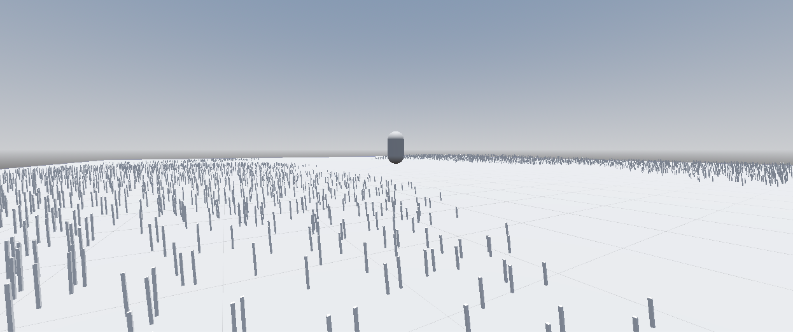
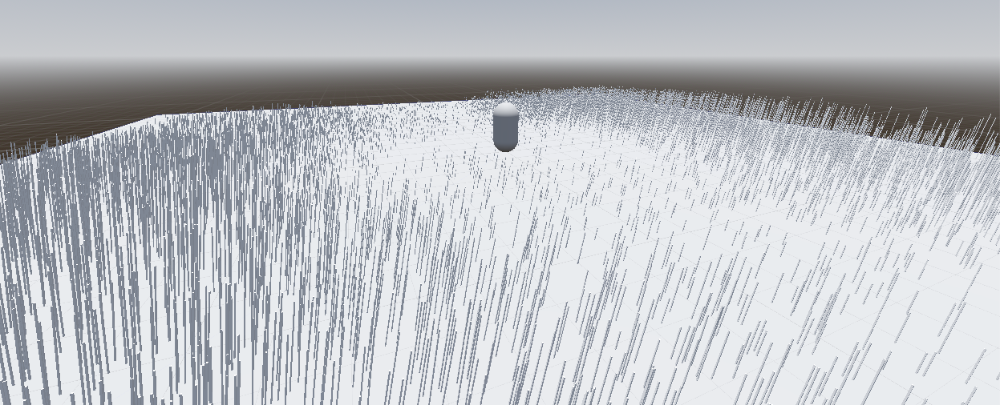

# 

## PROCEDURAL PROP PLACER

This C#-based Godot tool is designed to procedurally generate and place environment props within a 3D scene, with general setdressing and natural foliage in mind. Using the plugin's provided **ProceduralPropNode** and its associated interface, you'll be able to generate variations of the asset you've input based on the adjusted parameters.

### SETUP

*This plugin requires use of a .NET Godot project in order to properly use.* Once you've created your .NET Godot project,

1. Download the "addons/PropProcGen" folder from this repository.
2. If you do not already have an "addons" folder in your Godot project, place the given addons folder in your Godot project. Otherwise, extract the contents of this plugin's addons folder to your Godot project's own addons folder.
3. In the Godot editor, build your project from the interface or using Alt+B.
4. In **Project -> Project Settings -> Plugins**, enable the Procedural Prop Placer plugin.

Once you've done this, you now have access to the **ProceduralPropNode**, which you can directly place within the scene and begin using!

### PARAMETERS

#### OBJECT SETTINGS

- Object Mesh: Takes a mesh object as input.

#### Object Scaling

- Object X Scalar: A scalar that scales the given mesh along the X-axis.
- Object Y Scalar: A scalar that scales the given mesh along the Y-axis.
- Object Z Scalar: A scalar that scales the given mesh along the Z-axis.

#### GENERATION SETTINGS

#### Object Density

- **Maximum Objects:** The maximum amount of objects output by the ProceduralPropNode.

#### Noise

- **Fast Noise Lite:** Takes the Fast Noise Lite library as input, at which point the user can access the library's associated noise parameters.
  - *The noise offset is automatically determined by the ProceduralPropNode's position, so don't worry if you can't adjust the offset! This may change in future versions if users prefer having control over the offset regardless of position.*
- **Noise Scalar:** Scales the effects of the given noise parameters.

#### Jitter

- **Jitter Upper Bound:** The positive bound of the jitter offset.
- **Jitter Lower Bound:** The negative bound of the jitter offset.

#### X-Axis Scalar

- **Scale X:** Toggles whether noise affects x-axis scaling of procedurally-generated objects.
- **X Value Scalar:** A scalar applied to procedurally-generated objects' x-axis scaling.

#### Y-Axis Scalar

- **Scale Y:** Toggles whether noise affects y-axis scaling of procedurally-generated objects.
- **Y Value Scalar:** A scalar applied to procedurally-generated objects' y-axis scaling.

#### Z-Axis Scalar

- **Scale Z:** Toggles whether noise affects z-axis scaling of procedurally-generated assets.
- **Z Value Scalar:** A scalar applied to procedurally-generated assets' z-axis scaling.

#### X-Axis Rotation

- **Rotate X:** Toggles whether procedurally-generated objects are rotated about their x-axes.
- **Rotate X Upper Bound:** The upper limit for how far an object can rotate about its x-axis.
- **Rotate X Lower Bound:** The lowwer limit for how far an object can rotate about its x-axis.

#### Y-Axis Rotation

- **Rotate Y:** Toggles whether procedurally-generated objects are rotated about their y-axes.
- **Rotate Y Upper Bound:** The upper limit for how far an object can rotate about its y-axis.
- **Rotate Y Lower Bound:** The lowwer limit for how far an object can rotate about its y-axis.

#### Z-Axis Rotation

- **Rotate Z:** Toggles whether procedurally-generated objects are rotated about their z-axes.
- **Rotate Z Upper Bound:** The upper limit for how far an object can rotate about its z-axis.
- **Rotate Z Lower Bound:** The lowwer limit for how far an object can rotate about its z-axis.

#### CULLING SETTINGS

#### X-Axis Culling

- **Cull X Values:** Toggles whether procedurally-generated objects are culled based on their x-axis scale.
- **X Culling Minimum:** The lowest possible value of an object's x-axis scale before it gets culled.
- **X Culling Maximum:** The highest possible value of an object's x-axis scale before it gets culled.

#### Y-Axis Culling

- **Cull Y Values:** Toggles whether procedurally-generated objects are culled based on their y-axis scale.
- **Y Culling Minimum:** The lowest possible value of an object's y-axis scale before it gets culled.
- **Y Culling Maximum:** The highest possible value of an object's y-axis scale before it gets culled.

#### Z-Axis Culling

- **Cull Z Values:** Toggles whether procedurally-generated objects are culled based on their z-axis scale.
- **Z Culling Minimum:** The lowest possible value of an object's z-axis scale before it gets culled.
- **Z Culling Maximum:** The highest possible value of an object's z-axis scale before it gets culled.

#### Transform

- The ProceduralPropNode inherits from Node3D, meaning that it inherits its transform. The bounds for the generation field of the ProceduralPropNode are determined by its transform's X and Z scale and where it generates is based off its transform's position.

## 

## 

### KNOWN ISSUES/LIMITATIONS

- Object generation and jitter are only handled on the X-axis and Z-axis. This will change in future versions, with toggles that change generation and jitter to apply to XY, YZ, and XYZ axis combinations.
